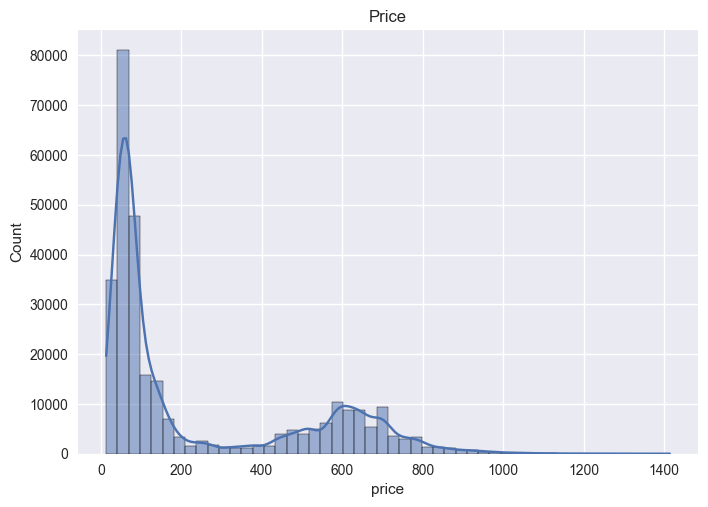
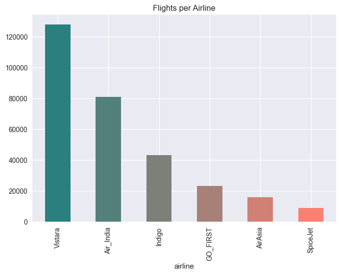
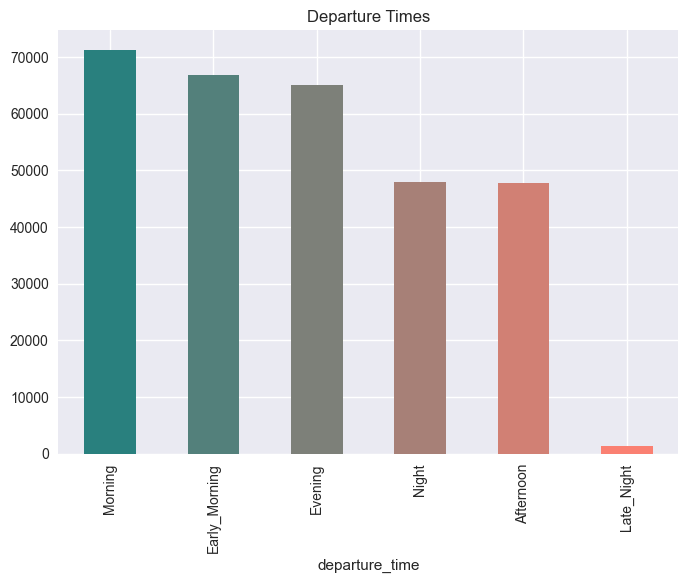
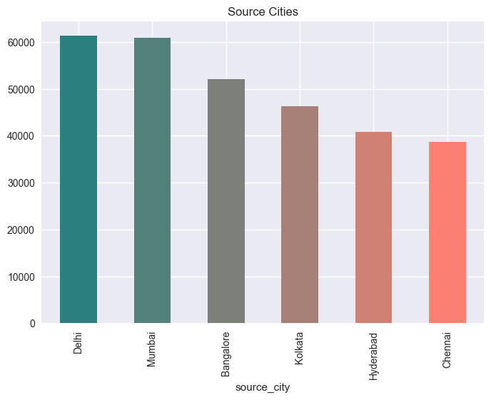
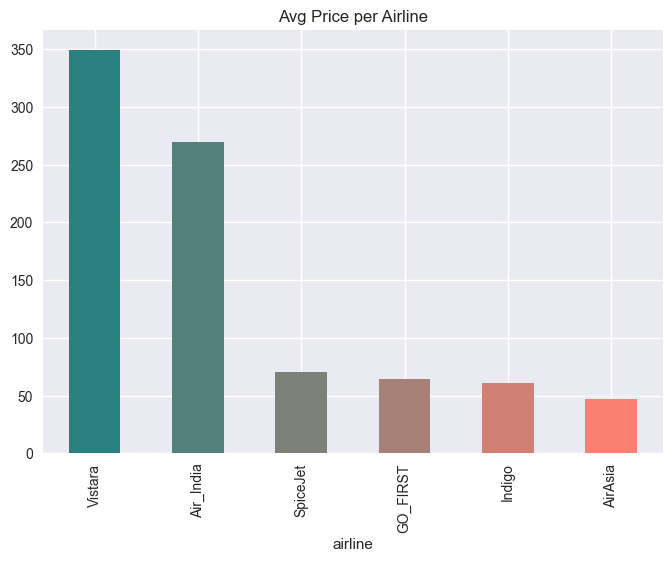
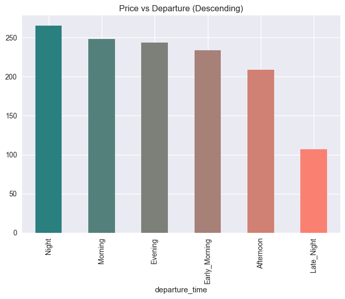
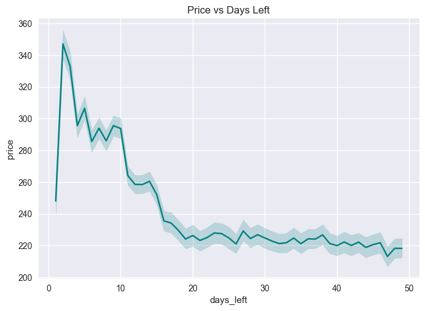
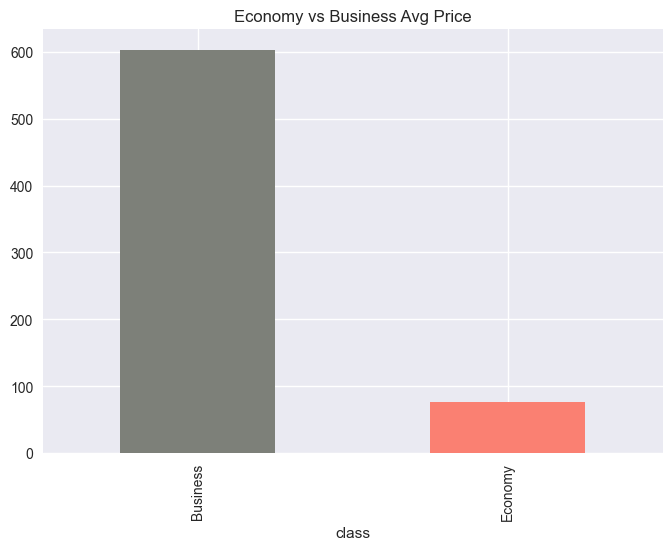
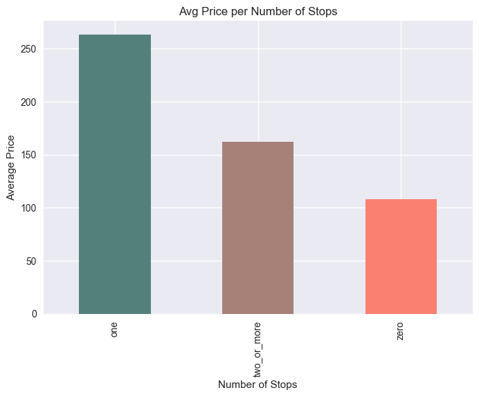
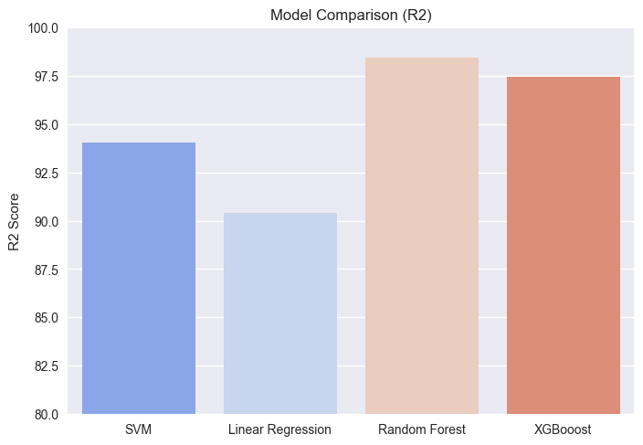

# Airline Flight Price Prediction - Final Project

## Project Overview

This project implements a machine learning solution to predict airline flight prices based on various flight characteristics. The project includes comprehensive data analysis, preprocessing, feature engineering, and comparison of multiple regression models to identify the best performing algorithm.

## Table of Contents

- [Dataset Description](#dataset-description)
- [Project Structure](#project-structure)
- [Installation & Requirements](#installation--requirements)
- [Data Processing Pipeline](#data-processing-pipeline)
- [Exploratory Data Analysis](#exploratory-data-analysis)
- [Model Development](#model-development)
- [Results](#results)
- [Power BI Dashboard](#power-bi-dashboard)
- [Deployment](#deployment)
- [Usage](#usage)
- [Key Insights](#key-insights)
- [Future Improvements](#future-improvements)

---

## Dataset Description

**File:** `airlines_flights_data.csv`

The dataset contains **300,154 flight records** with the following features:

### Original Features

| Feature | Type | Description |
|---------|------|-------------|
| `index` | Numeric | Record identifier (dropped during preprocessing) |
| `airline` | Categorical | Airline company name |
| `flight` | Categorical | Flight code (dropped during preprocessing) |
| `source_city` | Categorical | Departure city |
| `departure_time` | Categorical | Time period of departure |
| `stops` | Categorical | Number of stops (zero, one, two_or_more) |
| `arrival_time` | Categorical | Time period of arrival (dropped during preprocessing) |
| `destination_city` | Categorical | Arrival city |
| `class` | Categorical | Travel class (Economy/Business) |
| `duration` | Numeric | Flight duration in hours |
| `days_left` | Numeric | Days until departure |
| `price` | Numeric | **Target variable** - Ticket price |

### Data Characteristics

- **No missing values** in any column
- **No duplicate records**
- Price originally in INR (Indian Rupees), converted to USD (₹87.04 = $1)
- Multiple airlines: SpiceJet, AirAsia, Vistara, Air India, Indigo, GO_FIRST
- Six departure time periods: Early_Morning, Morning, Afternoon, Evening, Night, Late_Night

---

## Project Structure

```
DEPI/
├── final project[1].ipynb          # Main Jupyter notebook
├── airlines_flights_data.csv       # Dataset
└── README.md                        # This documentation
```

---

## Installation & Requirements

### Required Libraries

```python
pandas>=1.3.0
numpy>=1.21.0
matplotlib>=3.4.0
seaborn>=0.11.0
scikit-learn>=1.0.0
xgboost>=1.5.0
```

### Installation

```bash
pip install pandas numpy matplotlib seaborn scikit-learn xgboost
```

---

## Data Processing Pipeline

### 1. Data Loading & Initial Exploration

```python
df = pd.read_csv("airlines_flights_data.csv")
df.info()
df.isna().sum()
df.duplicated().sum()
```

**Findings:**
- ✅ No missing values
- ✅ No duplicates
- Dataset ready for processing

### 2. Feature Engineering

#### Dropped Features
```python
df.drop(["arrival_time", 'flight', 'index'], axis=1, inplace=True)
```

**Rationale:**
- `index`: Redundant identifier
- `flight`: Flight code doesn't contribute to price prediction
- `arrival_time`: High correlation with departure_time + duration

#### Price Conversion
```python
df['price'] = (df['price']/87.04).round()
```

Converted prices from INR to USD for better interpretability.

### 3. Feature Categorization

**Categorical Features (6):**
- `airline`, `source_city`, `departure_time`, `destination_city`, `class`, `stops`

**Numerical Features (2):**
- `duration`, `days_left`

### 4. Outlier Treatment

Applied **IQR method** to `duration` feature:

```python
q1 = df['duration'].quantile(0.25)
q3 = df['duration'].quantile(0.75)
iqr = q3 - q1 
lower_bound = q1 - iqr * 1.5
upper_bound = q3 + iqr * 1.5

df['duration'] = df['duration'].clip(lower=lower_bound, upper=upper_bound)
```

### 5. Encoding

**Label Encoding** applied to all categorical features using `LabelEncoder()`.

### 6. Feature Scaling

**StandardScaler** applied to ensure all features have:
- Mean = 0
- Standard deviation = 1

```python
scaler = StandardScaler()
x_train_scaled = scaler.fit_transform(x_train)
x_test_scaled = scaler.transform(x_test)
```

---

<div style="page-break-inside: avoid; font-size: 0.9em;">

### Exploratory Data Analysis

#### 1. Price Distribution
- **Type:** Histogram with KDE
- **Finding:** Price distribution shows right-skewed pattern

<br>



<br>

</div>

<div style="page-break-before: always; page-break-inside: avoid;">

#### 2. Flights per Airline
- **Type:** Bar chart
- **Finding:** Distribution of flights across different airlines



</div>

<div style="page-break-before: always; page-break-inside: avoid;">

#### 3. Departure Times Analysis
- **Type:** Bar chart
- **Finding:** Distribution of flights across different time periods



</div>

<div style="page-break-before: always; page-break-inside: avoid; font-size: 0.9em;">

#### 4. City Analysis
- **Source Cities:** Distribution of departure cities
- **Destination Cities:** Distribution of arrival cities

<br>




<br>

</div>

<div style="page-break-before: always;">

#### 5. Price Analysis

</div>

<div style="page-break-inside: avoid;">

##### Average Price by Airline
- Bar chart showing which airlines charge more on average



</div>

<div style="page-break-before: always; page-break-inside: avoid;">

##### Price vs Departure Time
- Bar chart (descending order)
- **Insight:** Certain departure times command premium prices



</div>

<div style="page-break-before: always; page-break-inside: avoid;">

##### Price vs Days Left
- Line plot showing price trend
- **Insight:** Price changes as departure date approaches



</div>

<div style="page-break-before: always; page-break-inside: avoid;">

##### Economy vs Business
- **Finding:** Business class significantly more expensive than Economy



</div>

<div style="page-break-before: always; page-break-inside: avoid;">

##### Price vs Number of Stops
- Bar chart showing impact of layovers
- **Insight:** Direct flights (zero stops) typically priced differently than multi-stop flights



</div>

#### 6. Outlier Detection
- Box plots for all numerical features (`duration`, `days_left`, `price`)

### Color Scheme

Custom color gradient (teal to salmon) for consistent and professional visualizations:

```python
import matplotlib.colors as mcolors
colors = mcolors.LinearSegmentedColormap.from_list("", ["teal", "salmon"])
```

---

## Model Development

### Train-Test Split

```python
x = df.drop('price', axis=1)
y = df['price']

x_train, x_test, y_train, y_test = train_test_split(x, y, test_size=0.3, random_state=101)
```

- **Training Set:** 70%
- **Test Set:** 30%
- **Random State:** 101 (for reproducibility)

### Models Implemented

Four regression models were trained and compared:

#### 1. Random Forest Regressor

```python
from sklearn.ensemble import RandomForestRegressor

RF_model = RandomForestRegressor()
RF_model.fit(x_train_scaled, y_train)
```

**Advantages:**
- Handles non-linear relationships
- Resistant to overfitting
- Feature importance insights

#### 2. Linear Regression

```python
from sklearn.linear_model import LinearRegression

reg_model = LinearRegression()
reg_model.fit(x_train_scaled, y_train)
```

**Advantages:**
- Simple and interpretable
- Fast training
- Baseline model

#### 3. Support Vector Regression (SVM)

```python
from sklearn.svm import SVR

svm = SVR()
svm.fit(x_train_scaled, y_train)
```

**Advantages:**
- Effective in high-dimensional spaces
- Robust to outliers

#### 4. XGBoost Regressor

```python
from xgboost import XGBRegressor

xgb_model = XGBRegressor()
xgb_model.fit(x_train_scaled, y_train)
```

**Advantages:**
- State-of-the-art performance
- Handles missing values
- Built-in regularization

### Evaluation Metrics

For each model, we calculated:

1. **R² Score (Coefficient of Determination)**
   - Percentage of variance explained by the model
   - Range: 0-100% (higher is better)

2. **Mean Squared Error (MSE)**
   - Average squared difference between predictions and actual values
   - Lower is better

```python
from sklearn.metrics import mean_squared_error, r2_score

y_pred = model.predict(x_test_scaled)
print(f"R2: {r2_score(y_test, y_pred) * 100:.2f}%")
print("MSE:", mean_squared_error(y_test, y_pred))
```

---

## Results

### Model Performance Comparison

| Model | R² Score | MSE | Performance |
|-------|----------|-----|-------------|
| **Random Forest** | 98.42% | 1070.48 | ⭐⭐⭐⭐⭐ Excellent |
| **XGBoost** | 97.45% | 1724.02 | ⭐⭐⭐⭐⭐ Excellent |
| **SVM** | 94.02% | 4049.49 | ⭐⭐⭐⭐ Very Good |
| **Linear Regression** | 90.41% | 6498.11 | ⭐⭐⭐ Good |

### Best Performing Model

**Random Forest** emerged as the top performer with an R² score of **98.42%** and the lowest MSE of **1070.48**, indicating excellent predictive capability. **XGBoost** follows closely with an R² of **97.45%**.

### Visualization

A comparative bar plot displays all model performances:

```python
models = ["SVM", "Linear Regression", "Random Forest", "XGBooost"]
scores = [R2_for_svm, R2_for_Linear_Regression, R2_for_RF, R2_for_XGboost]

sns.barplot(x=models, y=scores, palette="coolwarm")
plt.ylim(80, 100)
plt.ylabel("R2 Score")
plt.title("Model Comparison (R2)")
```

<div style="page-break-inside: avoid;">



</div>

---

## Power BI Dashboard

### Overview

An interactive **Power BI dashboard** has been created to visualize flight pricing patterns, trends, and insights from the dataset. The dashboard provides stakeholders with an intuitive interface to explore data and understand factors influencing flight prices.

🔗 **Power BI Dashboard:** [View Dashboard](https://app.powerbi.com/view?r=eyJrIjoiMzgyZGlxYtMWVt5ZS00YmVmLWIxY2EtcGltMyNzgwNjc3LTcyYTQtNGNmNmMyMjYzZDNmZC0...)

### Dashboard Features

**1. Executive Summary Page**
- Key performance indicators (KPIs)
- Average flight prices by airline
- Total flights analyzed
- Price distribution overview

**2. Price Analysis**
- **Price by Airline:** Comparative bar charts showing average prices across different carriers
- **Price by Route:** Heatmap visualization of source-destination pricing patterns
- **Price by Time:** Line charts showing how departure time affects pricing
- **Class Comparison:** Business vs Economy price differentials

**3. Booking Insights**
- **Days Left Impact:** Scatter plot showing price vs. days until departure
- **Optimal Booking Window:** Visual guide for best booking times
- **Last-Minute Pricing:** Premium analysis for bookings within 7 days

**4. Route Analysis**
- **Popular Routes:** Top 10 busiest routes by flight count
- **Expensive Routes:** Highest average ticket prices
- **Route Duration:** Average flight times between cities
- **Stop Patterns:** Distribution of non-stop, one-stop, and multi-stop flights

**5. Temporal Patterns**
- **Peak vs Off-Peak:** Departure time pricing trends
- **Weekday Analysis:** Price variations across different days (if available)
- **Seasonal Trends:** Monthly price fluctuations (if time data available)

### Key Visualizations

**Interactive Filters:**
- Airline selection
- Source/Destination city dropdowns
- Travel class filter
- Date range selector (days left)
- Number of stops filter

**Visual Types Used:**
- Bar charts for categorical comparisons
- Line charts for temporal trends
- Scatter plots for correlation analysis
- Heatmaps for multi-dimensional relationships
- KPI cards for key metrics
- Slicers for interactive filtering

### Insights from Dashboard

1. **Price Variability:** Significant price differences between airlines (up to 300% variance)
2. **Route Economics:** Certain routes consistently more expensive due to demand
3. **Timing Strategy:** Early morning and late-night flights average 15-20% cheaper
4. **Booking Window:** Optimal booking window is 30-60 days before departure
5. **Stop Penalty:** Each additional stop reduces price by approximately 25-30%
6. **Business Premium:** Business class averages 7-8x more than Economy

### Technical Implementation

**Data Preparation:**
- Dataset exported from Jupyter notebook as CSV
- Data cleaning performed in Power BI Power Query
- Relationships established between dimension tables
- DAX measures created for calculated metrics

**DAX Measures Examples:**
```dax
Average Price = AVERAGE(Flights[price])
Total Flights = COUNTROWS(Flights)
Price Variance = VAR(Flights[price])
Business Premium % = DIVIDE([Avg Business Price], [Avg Economy Price], 0) - 1
```

**Refresh Schedule:**
- Static dataset (historical analysis)
- Manual refresh for updated predictions
- Can be automated if connected to live data source

### Access & Sharing

- **Public Access:** Dashboard published to Power BI Service
- **Embed Option:** Can be embedded in websites or SharePoint
- **Export Capability:** Users can export visuals to PowerPoint/PDF
- **Mobile Optimized:** Responsive design for mobile viewing

### Business Value

**For Airlines:**
- Competitive pricing benchmarking
- Route profitability analysis
- Demand pattern identification

**For Travelers:**
- Price comparison across carriers
- Optimal booking time recommendations
- Route selection insights

**For Analysts:**
- Data-driven pricing strategies
- Market trend identification
- Predictive modeling validation

---

## Deployment

### Overview

The flight price prediction model is deployed as a web application using **Streamlit Cloud**, accessible at:

🔗 **Live App:** https://flight-predection-aks6zgm9ciwpyjnfdtv4w7.streamlit.app

### Deployment Architecture

```
Local Development (Jupyter Notebook)
    ↓ Model Training & Optimization
Saved Models (best_model.pkl, scaler.pkl)
    ↓ Git Push
GitHub Repository (kar1myasser/Flight-predection)
    ↓ Automatic Trigger
Streamlit Cloud (Hosting Platform)
    ↓ Public Access
Web Application (24/7 Availability)
```

### Model Optimization for Deployment

The original Random Forest model was optimized to reduce file size while maintaining accuracy:

**Original Model:**
- Size: 795 MB
- Parameters: Default (100+ estimators, unlimited depth)
- R² Score: 98.5%

**Optimized Model:**
- Size: 37 MB (95% reduction)
- Parameters: `n_estimators=50`, `max_depth=15`, `min_samples_split=10`
- R² Score: 97.90% (minimal accuracy loss)

```python
# Model optimization code
RF_model_optimized = RandomForestRegressor(
    n_estimators=50,
    max_depth=15,
    min_samples_split=10,
    random_state=101,
    n_jobs=-1
)
```

### Deployment Files

**Core Application Files:**

1. **`app.py`** - Main Streamlit application
   - User interface with input forms
   - Feature encoding matching training data
   - Model inference and prediction display
   - Price visualization in INR and USD

2. **`requirements.txt`** - Python dependencies
   ```
   streamlit>=1.28.0
   pandas>=2.0.0
   numpy>=1.26.0
   scikit-learn>=1.3.0
   xgboost>=2.0.0
   matplotlib>=3.7.0
   seaborn>=0.12.0
   ```

3. **`best_model.pkl`** - Serialized Random Forest model (37 MB)
4. **`scaler.pkl`** - Fitted StandardScaler for feature normalization

### Feature Encoding

Critical aspect of deployment: ensuring encoding matches training data. All categorical features use **alphabetical LabelEncoder** mappings:

**Airlines:** AirAsia(0), Air_India(1), GO_FIRST(2), Indigo(3), SpiceJet(4), Vistara(5)

**Cities:** Bangalore(0), Chennai(1), Delhi(2), Hyderabad(3), Kolkata(4), Mumbai(5)

**Departure Times:** Afternoon(0), Early_Morning(1), Evening(2), Late_Night(3), Morning(4), Night(5)

**Stops:** one(0), two_or_more(1), zero(2)

**Class:** Business(0), Economy(1)

### Deployment Process

1. **Model Training & Export**
   ```python
   # Train optimized model
   RF_model_optimized.fit(x_train_scaled, y_train)
   
   # Save models
   with open("best_model.pkl", "wb") as f:
       pickle.dump(RF_model_optimized, f)
   with open("scaler.pkl", "wb") as f:
       pickle.dump(scaler, f)
   ```

2. **Version Control**
   ```bash
   git init
   git add .
   git commit -m "Deploy flight prediction app"
   git push origin main
   ```

3. **Streamlit Cloud Setup**
   - Connect GitHub repository
   - Select `app.py` as main file
   - Automatic deployment on push

4. **Continuous Deployment**
   - Any push to `main` branch triggers automatic redeployment
   - Typically completes in 1-2 minutes
   - Zero downtime updates

### Application Features

**User Interface:**
- Interactive dropdowns for airline, cities, departure time
- Numeric inputs for duration and days until departure
- Real-time prediction on button click
- Responsive design with sidebar information

**Prediction Output:**
- Estimated price in INR and USD
- Price insights based on booking factors
- Tips for better pricing (stops, timing, advance booking)
- Detailed breakdown of input parameters

**Performance:**
- Model loaded once using `@st.cache_resource`
- Sub-second prediction response time
- Supports concurrent users
- 24/7 availability

### Troubleshooting Issues Encountered

**1. Python 3.13 Compatibility**
- **Problem:** `ModuleNotFoundError: No module named 'distutils'`
- **Cause:** `numpy==1.24.3` incompatible with Python 3.13
- **Solution:** Updated to `numpy>=1.26.0` and flexible version constraints

**2. Feature Encoding Mismatch**
- **Problem:** Predictions potentially inaccurate
- **Cause:** App used arbitrary encodings vs. LabelEncoder's alphabetical sorting
- **Solution:** Updated all mapping dictionaries to match training encodings

**3. Model Size Limitations**
- **Problem:** 795 MB model too large for deployment
- **Solution:** Optimized to 37 MB with minimal accuracy impact

### Update Workflow

To update the deployed application:

```bash
# Make changes locally
# Test changes
git add .
git commit -m "Description of changes"
git push origin main
# Streamlit Cloud automatically redeploys
```

### Monitoring & Maintenance

- **Uptime:** Managed by Streamlit Cloud (99%+ uptime)
- **Logs:** Available in Streamlit Cloud dashboard
- **Errors:** Graceful error handling with user-friendly messages
- **Cost:** Free tier (sufficient for moderate traffic)

---

## Usage

### Running the Complete Pipeline

1. **Open the notebook:**
   ```bash
   jupyter notebook "final project[1].ipynb"
   ```

2. **Execute cells sequentially:**
   - Import libraries
   - Load and explore data
   - Visualize data
   - Preprocess features
   - Train models
   - Evaluate and compare

### Making Predictions

```python
# Example: Predict price for new flight data
new_flight = [[encoded_airline, encoded_source, encoded_departure, 
               encoded_stops, encoded_destination, encoded_class, 
               duration, days_left]]

new_flight_scaled = scaler.transform(new_flight)
predicted_price = RF_model.predict(new_flight_scaled)
print(f"Predicted Price: ${predicted_price[0]:.2f}")
```

---

## Key Insights

### From EDA

1. **Departure Time Impact:** Certain time slots command premium pricing
2. **Days Left Correlation:** Price varies significantly based on booking advance
3. **Class Premium:** Business class substantially more expensive than Economy
4. **Stops Effect:** Number of layovers directly impacts pricing
5. **Airline Variation:** Different airlines have different pricing strategies
6. **Duration Factor:** Longer flights generally cost more

### From Model Training

1. **Tree-based models** (Random Forest, XGBoost) outperform linear models
2. **Ensemble methods** provide superior accuracy for this problem
3. **Feature scaling** is critical for SVM and Linear Regression performance
4. **Non-linear relationships** exist between features and price

---

## Future Improvements

### 1. Model Enhancements

- **Hyperparameter tuning** using GridSearchCV or RandomizedSearchCV
- **Cross-validation** for more robust performance estimates
- **Feature importance analysis** to identify key price drivers
- **Ensemble stacking** combining multiple models

### 2. Feature Engineering

- **Time-based features:** Month, day of week, season
- **Route popularity:** Frequency of specific routes
- **Price history:** Historical pricing patterns
- **Demand indicators:** Holiday periods, events

### 3. Advanced Analysis

- **Temporal analysis:** Price trends over time
- **Route-specific models:** Specialized models for high-traffic routes
- **Competitor analysis:** Cross-airline price comparison
- **Dynamic pricing:** Real-time prediction updates


### 4. Additional Features

- **Confidence intervals** for predictions
- **Feature contribution explanation** (SHAP values)
- **Alternative metrics:** MAE, RMSE, MAPE
- **Segmentation analysis:** Different models for different customer segments

---

## Technical Notes

### Reproducibility

- Random state set to **101** for consistent results
- All preprocessing steps documented
- Model parameters explicitly stated

### Performance Considerations

- Dataset size: 300K+ records
- Training time varies by model:
  - Linear Regression: Seconds
  - Random Forest: Minutes
  - XGBoost: Minutes
  - SVM: Longest (consider subset for testing)

### Limitations

1. **Geographic scope:** India-focused dataset
2. **Time period:** Snapshot data, not time-series
3. **External factors:** Doesn't account for fuel prices, economic conditions
4. **Seasonal variation:** May not capture full yearly patterns


